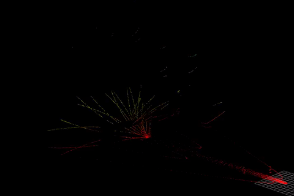

<!--
 * @Author: xindong324
 * @Date: 2023-03-07 21:09:34
 * @LastEditors: xindong324
 * @LastEditTime: 2023-03-12 10:29:09
 * @Description: file content
-->
# A modified Livox Laser Simulation
This repo is the modified version of [Livox Laser Simulation](https://github.com/Livox-SDK/livox_laser_simulation), used for adapt the livox avia on the husky robot.
We modify the src/livox_points_plugin.cpp to allow the link of the laser fixed directly on the body_link -- base_link for example. (Previous version is fixed on the ${robot_name}/base_link and may lead to some bugs such as unavilable of the controller topic). The library files after modified is provided and the sample of the husky urdf files(place in husky_description/urdf) laied in urdf/.
As an example, to put the livox avia on husky, adding these code in the urdf files.
```
<!-- laser link and visual define -->
<link name="laser_livox">
    <visual>
      <geometry>
        <box size="0.05 0.03 0.03" rpy="0 0 0"/>
      </geometry>
    </visual>
    <collision>
      <origin xyz="0 0 0.0" rpy="0 0 0" />
      <geometry>
        <box size="0.05 0.03 0.03" rpy="0 0 0"/>
      </geometry>
    </collision>
    </link>
  <!-- fix laser on base link -->
  <joint name="livox_link_joint" type="fixed">
    <origin xyz="0.5 0 0.09" rpy="0 0 0" />
    <parent link="base_link" />
    <child link="laser_livox" />
  </joint>


    <!-- def fov here is avia -->
  <xacro:property name="horizontal_fov" value="70.4"/>
  <xacro:property name="vertical_fov" value="77.2"/>
  <gazebo reference="laser_livox">
      <sensor type="ray" name="laser_livox">
        <pose>0 0 0 0 0 0</pose>
        <visualize>true</visualize>
        <update_rate>10</update_rate>
        <plugin name="gazebo_ros_laser_controller" filename="liblivox_laser_simulation.so">
           <!-- important!!, provide the namespace and link the laser attached -->
           <!-- if robot namespace is /, bodyName is base_link, then the tf transformation from /base_link to /laser_livox will be published-->
	        <robotNamespace>$(arg robot_namespace)</robotNamespace>
            <bodyName>base_link</bodyName>
			<ray>
			  <scan>
				<horizontal>
				<samples>100</samples>
				<resolution>1</resolution>
				<min_angle>${-horizontal_fov/360*M_PI}</min_angle>
				<max_angle>${horizontal_fov/360*M_PI}</max_angle>
				</horizontal>
				<vertical>
				<samples>50</samples>
				<resolution>1</resolution>
				<min_angle>${-vertical_fov/360*M_PI}</min_angle>
				<max_angle>${vertical_fov/360*M_PI}</max_angle>
				</vertical>
			  </scan>
			  <range>
				<min>0.1</min>
				<max>200</max>
				<resolution>0.002</resolution>
			  </range>
			  <noise>
				<type>gaussian</type>
				<mean>0.0</mean>
				<stddev>0.01</stddev>
			  </noise>
			</ray>
          <visualize>true</visualize>
		  <samples>24000</samples>
		  <downsample>1</downsample>
		  <csv_file_name>package://livox_laser_simulation/scan_mode/avia.csv</csv_file_name>
		  <ros_topic>livo_scan</ros_topic>
        </plugin>
      </sensor>
    </gazebo>
```


> below is the origin content
----------------------------------------------------------

## Requirements
- ROS(=Melodic)
- Gazebo (= 9.x, http://gazebosim.org/)
- Ubuntu(=18.04)

## Results
- avia


- mid40


- mid70


- tele


- horizon


## Usage

> Note that the version of gazebo in main branch is gazebo 9.18. If you use gazebo 7, checkout to "gazebo7" branch.

Before you write your urdf file by using this plugin, catkin_make/catkin build is needed.

A simple demo is shown in livox_simulation.launch

Run 
```
    roslaunch livox_laser_simulation livox_simulation.launch
```
to see.

We can choose the lidar model by selecting different CSV file in scan_mode dir from changing the launch file:
- avia.csv
- horizon.csv
- mid40.csv
- mid70.csv
- tele.csv

## Parameters(only for display , and example by avia)

- laser_min_range: 0.1  // min detection range
- laser_max_range: 200.0  // max detection range
- horizontal_fov: 70.4   //°
- vertical_fov: 77.2    //°
- ros_topic: scan // topic in ros
- samples: 24000  // number of points in each scan loop
- downsample: 1 // we can increment this para to decrease the consumption

### Thanks to LvFengchi and CaoMing(https://github.com/EpsAvlc) for the help of this repository！
